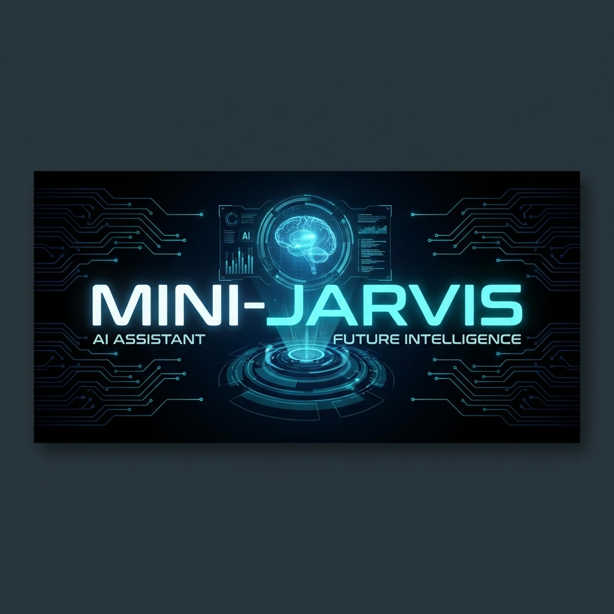

# 🤖 MINI-JARVIS



MINI-JARVIS is a simple Python-based assistant that automates your workspace setup with a single voice command.

## Description

Currently, this project is designed to automatically initialize the workspace for developers. It streamlines the startup process to help you get ready to work efficiently.

## 🚀 Quick Start

1. **Install Dependencies**:
   ```bash
   pip install -r requirements.txt
   ```

2. **Run JARVIS**:
   ```bash
   python jarvis.py
   ```

3. **Wake Command**:
   Say **"Wake up"** to automatically open and arrange VS Code, Spotify, and ChatGPT.

---

## 📦 Standalone App
Don't want to install Python? 
[**Download the latest JARVIS.exe**](https://github.com/kaya0s/Mini-Jarvis/releases/latest/download/JARVIS.exe)

*(Or run `build_jarvis.bat` to build it yourself)*

## Future Enhancements
I plan to make the application more dynamic and add significant functionalities in the future, including:
- Advanced voice recognition
- Dynamic task handling
- Enhanced automation capabilities

---
## 📄 License
MIT License.
